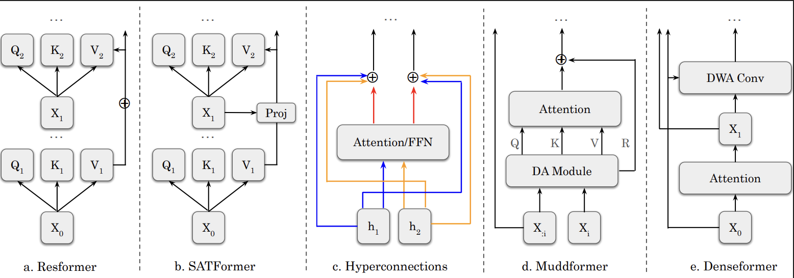

<div align="center">

# SATFormer: Selective Access Transformer

**Transformers with Selective Access to Early Representations**

[](https://arxiv.org/abs/2605.03953)
[](LICENSE)
[](https://www.python.org/)
[](https://pytorch.org/)

</div>

<p align="center">
  
</p>

<p align="center">
  <em>
    SATFormer extends value residual learning by giving each layer selective, token-wise and head-wise access to early value representations.
  </em>
</p>

## Overview

Standard decoder-only Transformers pass information forward through the residual stream. SATFormer adds a lightweight pathway that lets later attention layers reuse the value projection from the first layer, but only when a learned, token-dependent gate chooses to do so.

At layer 1, the model stores the first-layer value projection:

```text
V_1 = value projection from attention layer 1
```

At later layers, SATFormer computes a per-token, per-KV-head gate from the current hidden state and mixes `V_1` into the current value stream:

```text
alpha_n = gate(W_alpha h_n)
V'_n    = V_n + alpha_n * V_1
```

This makes early-representation reuse **selective** rather than static. The added parameter cost is small: each SATFormer layer that uses the pathway adds a projection from `hidden_size` to `num_kv_heads`.

The implementation lives in:

```text
models/satformer/
├── configuration_satformer.py
├── modeling_satformer.py
└── attn_satformer.py
```

The key module is `ValueResidualMixing` in `models/satformer/attn_satformer.py`.

---

## Included model variants

The repository includes SATFormer and the main comparison architectures used by the training configs.

| Variant | Path | Description |
|---|---|---|
| Transformer | `models/transformer/` | Standard decoder-only Transformer baseline. |
| ResFormer | `models/resformer/` | Static first-layer value residual pathway. Later layers reuse `V_1` with learned layer-wise coefficients. |
| SATFormer | `models/satformer/` | Selective first-layer value access with token-wise and KV-head-wise learned gates. |
| DenseFormer | `models/denseformer/` | Dense cross-layer connectivity baseline. |
| MUDDFormer | `models/muddformer/` | Multi-input attention / dense dynamic routing baseline. |
| HyperConnections | `models/hyperconnections/` | Dynamic hyper-connection baseline. |

Experiment configs are stored in:

```text
configs/
├── transformer/{small,medium,large,xl}.json
├── resformer/{small,medium,large,xl}.json
├── satformer/{small,medium,large,xl}.json
├── denseformer/{small,medium,large}.json
├── muddformer/{small,medium,large}.json
└── hyperconnections/{small,medium,large}.json
```

The `small`, `medium`, `large`, and `xl` configs define the model shape, optimizer settings, token budget, checkpoint directory, and logging configuration.

---

## Repository structure

```text
.
├── configs/                  # JSON configs for each architecture/scale
├── models/                   # Model implementations
├── prepare_fineweb.py         # FineWeb-Edu tokenization/preprocessing script
└── train.py                   # Distributed training script
```

`train.py` supports both single-GPU and distributed training. If launched with `torchrun`, it automatically uses PyTorch Distributed Data Parallel.

---

## Installation

Create a fresh Python environment and install the core dependencies:

```bash
conda create -n satformer python=3.10 -y
conda activate satformer

pip install --upgrade pip
pip install torch transformers datasets tokenizers accelerate einops numpy tqdm wandb safetensors
pip install flash-attn --no-build-isolation
pip install flash-linear-attention
```

Notes:

- The attention implementations require FlashAttention. If `flash-attn` is missing, model initialization will raise an import error.
- The model code imports modules from `fla`, provided by the `flash-linear-attention` package.
- The training configs use bfloat16 by default, so Ampere-or-newer NVIDIA GPUs are recommended.
- `wandb` is optional. If you do not want Weights & Biases logging, set `wandb_project` to `null` in the config or remove the field.

---

## Preparing FineWeb-Edu

The primary training setup uses **FineWeb-Edu** from Hugging Face:

```text
HuggingFaceFW/fineweb-edu, subset sample-100BT
```

The preprocessing script streams the dataset, tokenizes text with a Llama-2 tokenizer, and writes packed token IDs as `uint16` binary files:

```text
data/
├── train.bin
└── val.bin
```

### 1. Log in to Hugging Face

The current preprocessing script uses:

```python
TOKENIZER_ID = "NousResearch/Llama-2-7b-hf"
```

This tokenizer may require Hugging Face authentication and access approval.

```bash
huggingface-cli login
```

### 2. Generate tokenized data

For a quick smoke test:

```bash
python prepare_fineweb.py \
  --tokens 100000000 \
  --output data \
  --workers 16 \
  --batch_size 1000 \
  --val_fraction 0.005 \
  --seed 42
```

For the full token budget used by the largest included configs, prepare at least 30B tokens:

```bash
python prepare_fineweb.py \
  --tokens 30000000000 \
  --output data \
  --workers 32 \
  --batch_size 1000 \
  --val_fraction 0.005 \
  --seed 42
```

Approximate storage requirement: token IDs are stored as `uint16`, so 30B tokens require roughly 60 GB before filesystem overhead.

The training dataloader looks for files matching:

```text
train*.bin
val*.bin
```

so the default `train.bin` and `val.bin` files produced by `prepare_fineweb.py` work out of the box.

---

## Reproducing the primary training experiments

All primary experiments are launched through `train.py` with a JSON config.

### Single-GPU launch

```bash
python train.py --config configs/satformer/small.json
```

### Multi-GPU launch

Use `torchrun` for distributed training:

```bash
torchrun --standalone --nproc_per_node=8 train.py \
  --config configs/satformer/small.json
```

`train.py` detects distributed environment variables and automatically enables DDP.

### SATFormer experiments

```bash
# Small: 5B training tokens
torchrun --standalone --nproc_per_node=8 train.py --config configs/satformer/small.json

# Medium: 10B training tokens
torchrun --standalone --nproc_per_node=8 train.py --config configs/satformer/medium.json

# Large: 20B training tokens
torchrun --standalone --nproc_per_node=8 train.py --config configs/satformer/large.json

# XL: 30B training tokens
torchrun --standalone --nproc_per_node=8 train.py --config configs/satformer/xl.json
```

### Transformer and ResFormer baselines

```bash
# Transformer
for scale in small medium large xl; do
  torchrun --standalone --nproc_per_node=8 train.py --config configs/transformer/${scale}.json
done

# ResFormer
for scale in small medium large xl; do
  torchrun --standalone --nproc_per_node=8 train.py --config configs/resformer/${scale}.json
done
```

### Dense/dynamic comparison baselines

DenseFormer, MUDDFormer, and HyperConnections configs are provided for `small`, `medium`, and `large`:

```bash
for arch in denseformer muddformer hyperconnections; do
  for scale in small medium large; do
    torchrun --standalone --nproc_per_node=8 train.py --config configs/${arch}/${scale}.json
  done
done
```

---

## Config summary

The included configs use sequence length 4096 and cosine decay by default.

| Scale | Hidden size | Layers | Heads | Token budget |
|---|---:|---:|---:|---:|
| Small | 768 | 11 | 12 | 5B |
| Medium | 1024 | 18 | 16 | 10B |
| Large | 1536 | 19 | 24 | 20B |
| XL | 2048 | 24 | architecture-specific | 30B |

Training hyperparameters are specified inside each JSON config under:

```text
model.config_overrides
training
checkpointing
logging
system
```

For example, `configs/satformer/small.json` defines:

```json
{
  "data": {
    "data_dir": "data",
    "seq_length": 4096
  },
  "training": {
    "batch_size": 64,
    "gradient_accumulation_steps": 1,
    "learning_rate": 0.002,
    "min_lr": 0.0002,
    "warmup_tokens": 0.05,
    "max_tokens": 5.0,
    "dtype": "bfloat16"
  }
}
```

Effective batch size is:

```text
effective_batch = batch_size * gradient_accumulation_steps * world_size
```

and tokens per optimizer step are:

```text
tokens_per_step = effective_batch * seq_length
```

---

## Checkpoints and resuming

Each config writes checkpoints to its own directory, for example:

```text
checkpoints/satformer/small/
├── latest/
└── final/
```

The `latest/` directory contains training state and model weights. The `final/` directory contains a Hugging Face-style saved model.

Resume training from the latest checkpoint with:

```bash
torchrun --standalone --nproc_per_node=8 train.py \
  --config configs/satformer/small.json \
  --resume checkpoints/satformer/small/latest
```

---

## Logging

By default, configs include Weights & Biases metadata:

```json
"logging": {
  "wandb_project": "experiments",
  "wandb_run_name": "satformer-small"
}
```

To disable W&B logging, set:

```json
"wandb_project": null,
"wandb_run_name": null
```

The script also logs training loss, learning rate, gradient norm, tokens/sec, validation loss, validation perplexity, and token progress to stdout.

---

## Working with SATFormer gates

SATFormer supports several gate functions through `value_residual_gate`:

```text
relu, sigmoid, softmax, softmax_sigmoid, tanh, identity
```

The default is:

```json
"value_residual_gate": "relu"
```

The relevant config fields are:

```json
{
  "use_value_residual": true,
  "value_residual_gate": "relu",
  "value_residual_proj_bias": false,
  "value_residual_last_k": null
}
```

`value_residual_last_k` can be used to restrict selective value access to only the last `k` layers. If it is `null`, all layers after the first can access `V_1`.

---

## Minimal smoke test

To verify that the environment, data pipeline, and model code are wired correctly:

```bash
# 1. Prepare a small local dataset
python prepare_fineweb.py --tokens 100000000 --output data --workers 8

# 2. Optionally reduce max_tokens in configs/satformer/small.json for a short run
#    e.g. set "max_tokens": 0.01

# 3. Launch training
python train.py --config configs/satformer/small.json
```

A successful run should print the model class, parameter count, tokens per step, learning-rate schedule, training loss, and validation loss.

---

## Citation

If you use SATFormer in your research, please cite:

```bibtex
@misc{gunasekaran2026transformersselectiveaccessearly,
      title={Transformers with Selective Access to Early Representations}, 
      author={Skye Gunasekaran and Téa Wright and Rui-Jie Zhu and Jason Eshraghian},
      year={2026},
      eprint={2605.03953},
      archivePrefix={arXiv},
      primaryClass={cs.LG},
      url={https://arxiv.org/abs/2605.03953}, 
}
```


---

## License

CC By 4.0

---

## Acknowledgements

This repository builds on the PyTorch, Hugging Face Transformers, FlashAttention, and Flash Linear Attention ecosystems.
